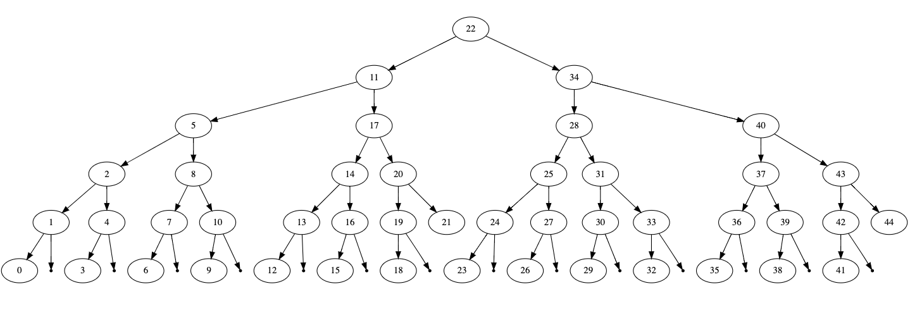

# Coding exercises :sunglasses: :computer:

Solutions to various (fun) coding exercises. All sorts of complexity levels,
from very easy to big-tech-interview level.

Sources:
- Leetcode
- X, Y Coursera MOOCs
- [w3resource](https://www.w3resource.com/python-exercises/)
- [Clément Mihailescu Youtube channel](https://www.youtube.com/channel/UCaO6VoaYJv4kS-TQO_M-N_g)
- [CS Dojo Youtube channel](https://www.youtube.com/channel/UCxX9wt5FWQUAAz4UrysqK9A)
- Cracking the Coding Interview by Gayle Laakmann McDowell :green_heart: